<p align="center">
  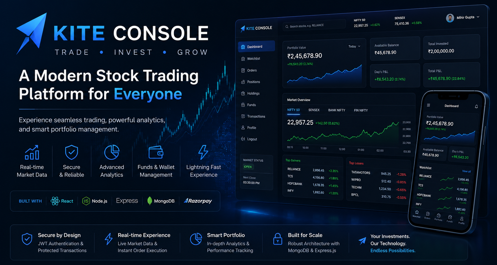
</p>

<h1 align="center">📊 KITE CONSOLE</h1>

<p align="center">
  <strong>Premium Full-Stack Stock Trading Simulator & Portfolio Manager</strong>
</p>

<p align="center">
Execute orders • Match limit trades • Sync nightly settlements • Analyze portfolio allocations
</p>

<p align="center">

<a href="https://stock-trading-platform-dashboard-six.vercel.app">

</a>

&nbsp;

<a href="https://github.com/mihirgupta665/Stock-Trading-Platform-">

</a>

&nbsp;

<a href="./assets/ZerodhaVideo.mp4">

</a>

</p>

<p align="center">


</p>

---

# 🌍 Live Demo

Experience the complete stock trading and brokerage simulator, featuring margin balance accounts, limit order matching schedulers, endpoints validation, ledger auditing, and full security lifecycles.

### 🚀 Live Application

<p align="center">
  <a href="https://stock-trading-platform-dashboard-six.vercel.app">
    
  </a>
</p>

<p align="center">
  <strong>
    Marketing Portal: <a href="https://stock-trading-platform-frontend-six.vercel.app">https://stock-trading-platform-frontend-six.vercel.app</a>
  </strong>
  <br>
  <strong>
    Console Dashboard: <a href="https://stock-trading-platform-dashboard-six.vercel.app">https://stock-trading-platform-dashboard-six.vercel.app</a>
  </strong>
</p>

### 🔑 Demo Account Credentials

| Email Address | Password |
|:---------:|:--------:|
| **demo@zerodha.com** | **password123** |

> **Note:** Use this account to log in and immediately test limit order routing, cash ledger transactions, deposits, and EOD holding conversions.

---

# 📖 About Kite Console

Kite Console is a production-inspired stock trading simulator that replicates the core brokerage functionalities of modern exchanges. The application focuses on data consistency, transaction rollbacks, security authentication, and automated nightly settlements.

Built using an Express API backend, MongoDB Atlas, and dual React client origins (the marketing portal and console dashboard), the application simulates real-world brokerage rules: immediate asset locking for pending limit trades, nightly Cron settlement executing inside database session transactions, timezone-locked market hour validators, and bi-directional SSO logout synchronization.

---

# ⭐ Project Highlights

- 🔐 **Cross-Origin Session Sync**: Bi-directional token synchronization and bfcache back-button navigation protection.
- 💰 **Double-Spending Prevention**: Real-time asset locks for active orders (blocking margin or shares immediately).
- 📈 **Hybrid EOD Settlement**: An automated nightly settlement engine running in Mongoose transactions with an "Active-on-Wake" dynamic fallback logic for cold-starting environments.
- ⚡ **Asynchronous Order Matcher**: Background schedulers evaluating pending limit orders against mock market ticks.
- 💳 **Razorpay Sandbox Integration**: Checkout workflows enabling mock deposits to load simulated capital.
- 📊 **Dynamic Portfolio Analytics**: Asset allocation breakdowns visualized via interactive Chart.js doughnut panels.
- 🛡️ **Rate-Limiting & Security Headers**: Helmet.js configurations and endpoint request throttling.

---

# 📑 Table of Contents

- 📖 About
- ⭐ Project Highlights
- 🎥 Demo GIF
- 📸 Project Showcase
- 🎬 Demo Video
- ✨ Features
- 🛠️ Technology Stack
- 🏗️ System Architecture
- 📁 Project Structure
- 🔌 REST API Directory
- ⚙️ Installation & Setup
- 🔐 Environment Variables
- 🚀 Deployment Overview
- 📈 Engineering Highlights (Deep Dives)
- 🔮 Future Improvements
- 🤝 Contributing
- 📄 License
- 👨💻 Author

---

# 🎥 Project Demonstration

A quick walkthrough of **Kite Console**, showcasing the complete user journey—from placing orders to checking daily asset migrations.

<p align="center">
  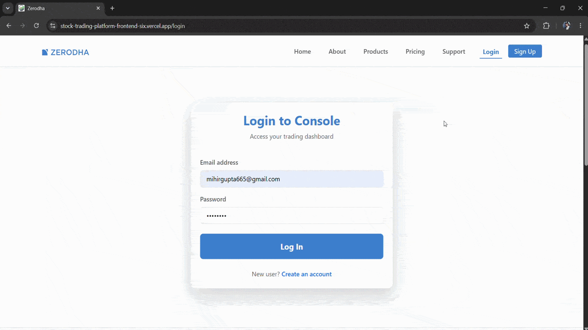
</p>

---

# 📸 Application Walkthrough

Experience the complete **Kite Console** ecosystem through the screenshots below. The walkthrough covers both the **Marketing Website** and the **Trading Dashboard**, taking you through the complete journey—from discovering the platform to securely managing investments.

---

# 🌐 Marketing Website

## 1️⃣ Landing Page

The first impression of Kite Console, introducing the platform and guiding users toward account creation.

<p align="center">
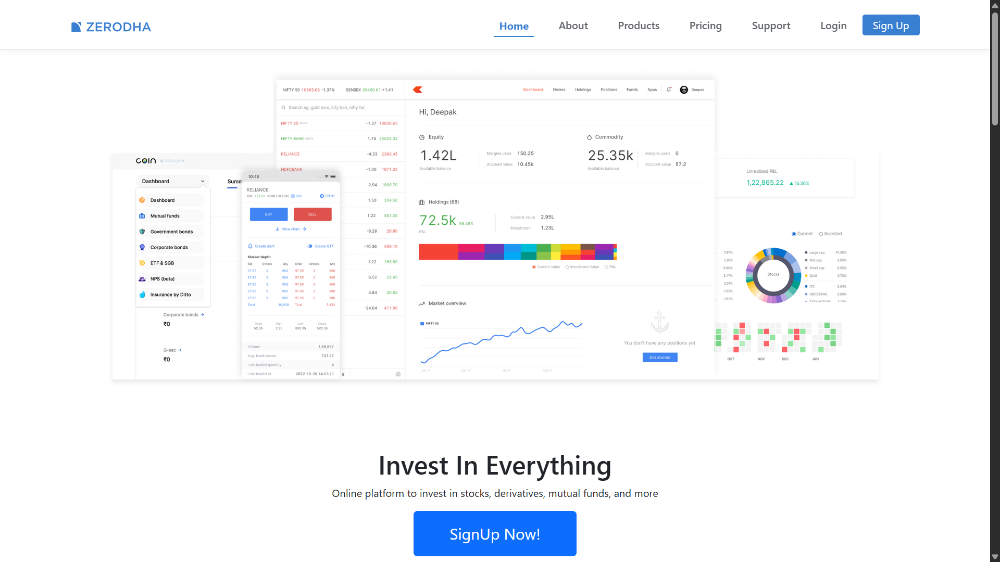
</p>

---

## 2️⃣ About Page

Learn about the platform's vision, mission, statistics, and core philosophy.

<p align="center">
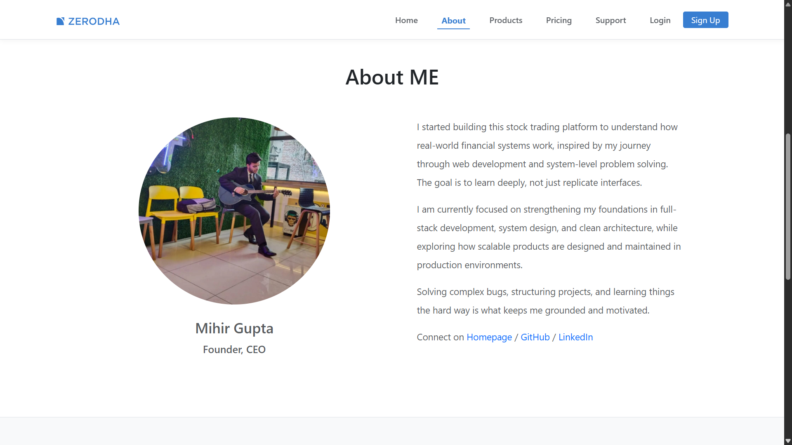
</p>

---

## 3️⃣ Products Page

Explore the products and investment services available within the ecosystem.

<p align="center">
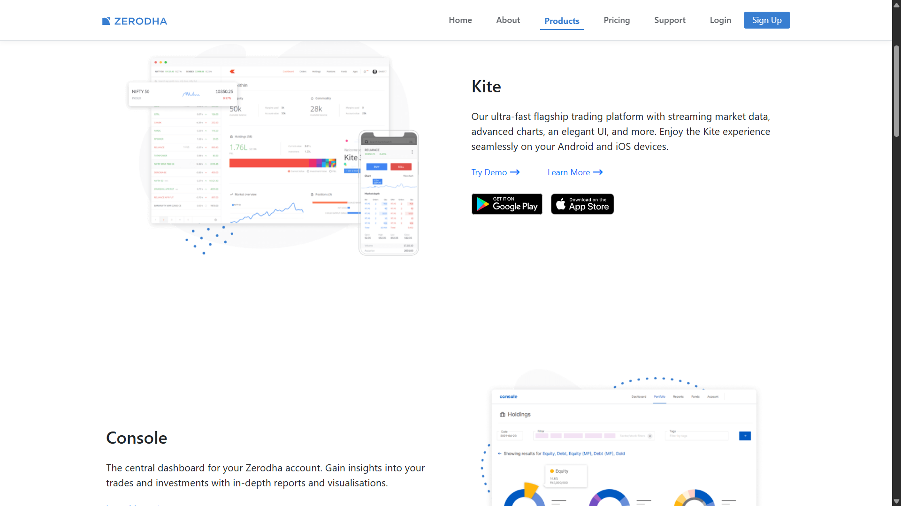
</p>

---

## 4️⃣ Pricing Page

View brokerage plans, pricing details, and the interactive nested-routing interface.

<p align="center">
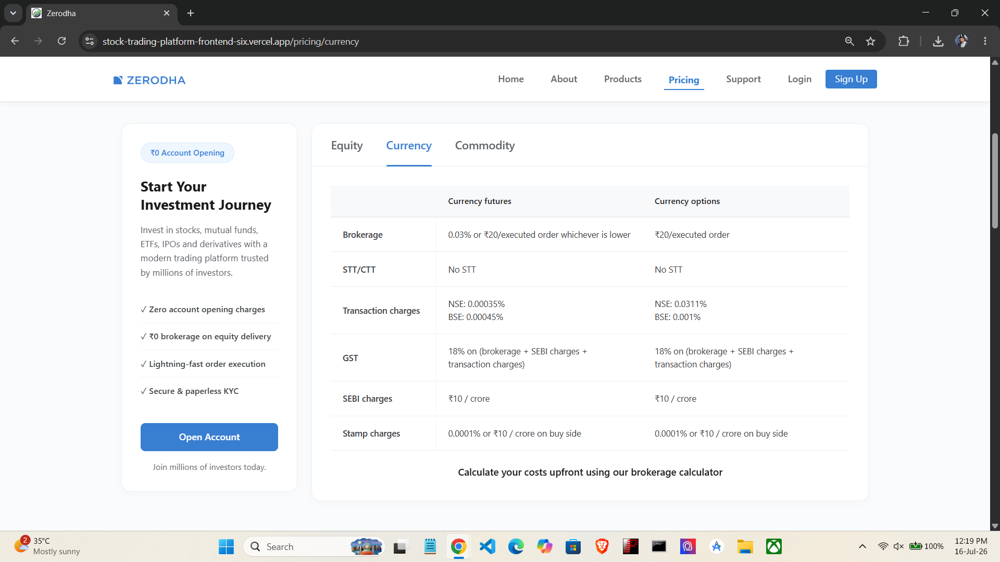
</p>

---

## 5️⃣ Support Page

Interactive support center with categorized FAQs and expandable help sections.

<p align="center">
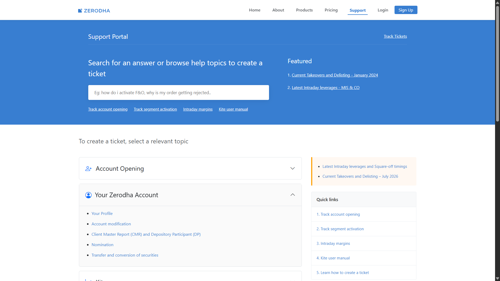
</p>

---

## 6️⃣ Login Page

Secure authentication before entering the trading dashboard.

<p align="center">
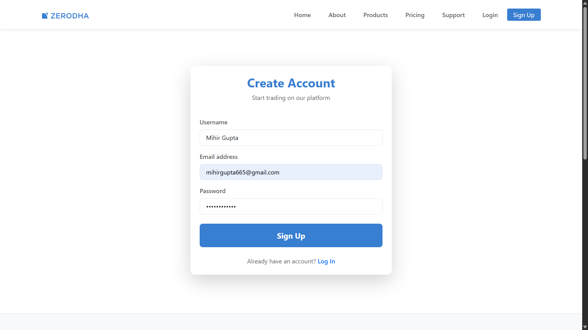
</p>

---

## 7️⃣ Authentication Success

Protected dashboard gateway after successful authentication.

<p align="center">
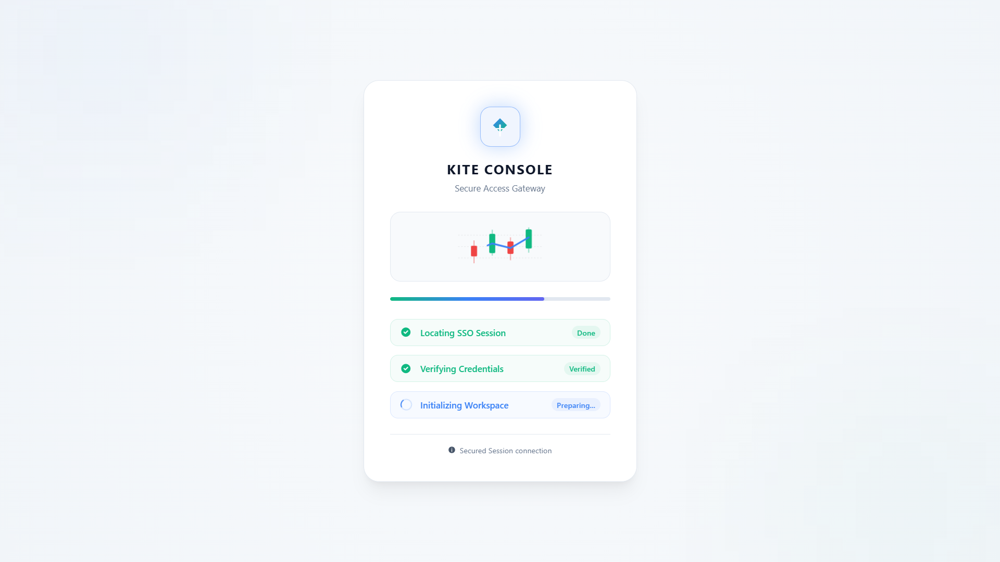
</p>

---

# 💻 Trading Dashboard

## 8️⃣ Dashboard Overview

Portfolio overview displaying investments, available balance, holdings, positions, and analytics.

<p align="center">
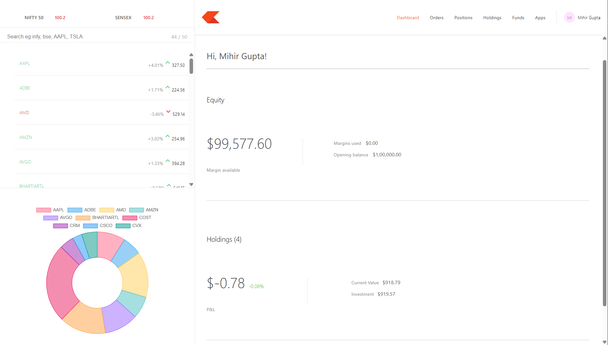
</p>

---

## 9️⃣ Watchlist & Buy Order

Monitor market activity and place Market or Limit orders directly from the watchlist.

<p align="center">
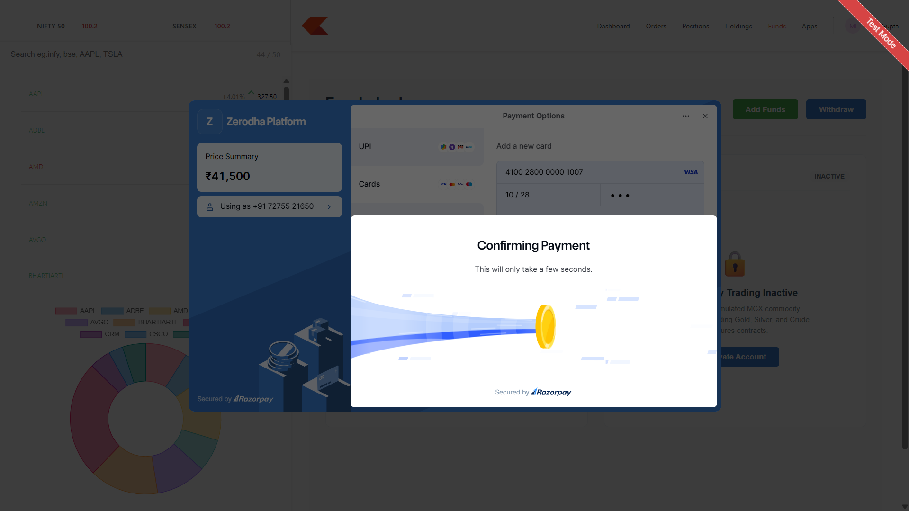
</p>

---

## 🔟 Orders

Review submitted orders together with execution status and transaction details.

<p align="center">
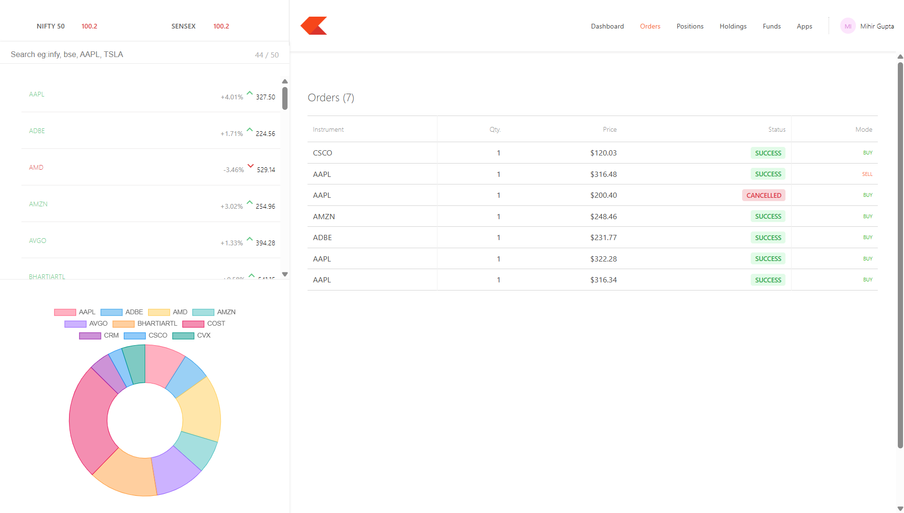
</p>

---

## 1️⃣1️⃣ Positions

Track active trading positions with invested value, current valuation, and unrealized profit or loss.

<p align="center">
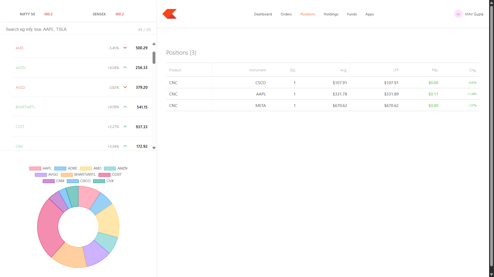
</p>

---

## 1️⃣2️⃣ Holdings

View permanently settled holdings after the End-of-Day settlement process.

<p align="center">
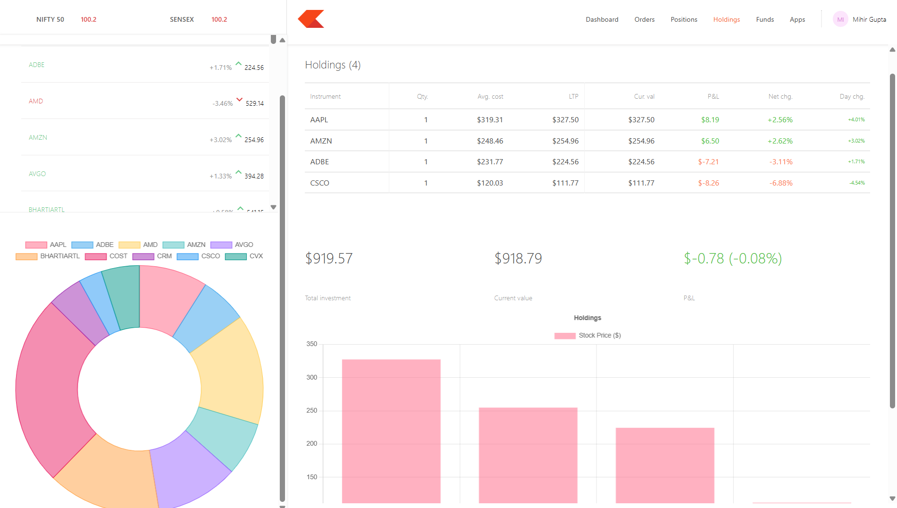
</p>

---

## 1️⃣3️⃣ Funds

Manage wallet balance, margin availability, deposits, and withdrawals.

<p align="center">
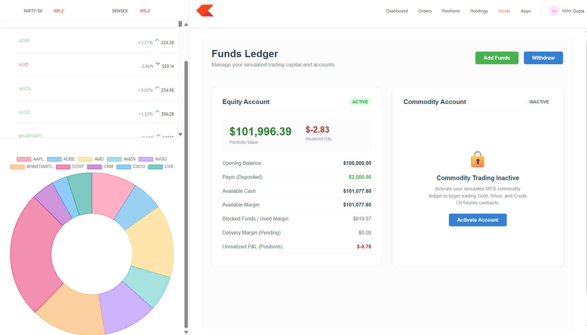
</p>

---

## 1️⃣4️⃣ Apps

Integrated applications available within the Kite Console ecosystem.

<p align="center">
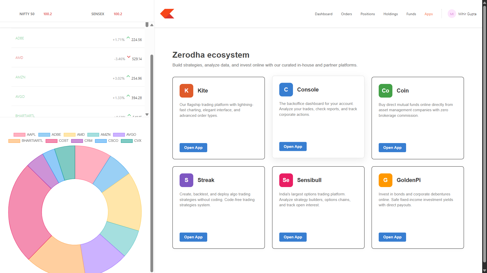
</p>

---

# 📱 Responsive Experience

## 1️⃣5️⃣ Mobile Landing Page

Optimized marketing website for mobile devices.

<p align="center">
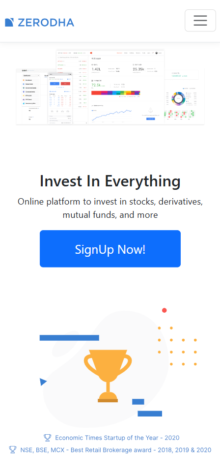
</p>

---

## 1️⃣6️⃣ Mobile Trading Dashboard

Fully responsive dashboard delivering the complete trading experience on mobile devices.

<p align="center">
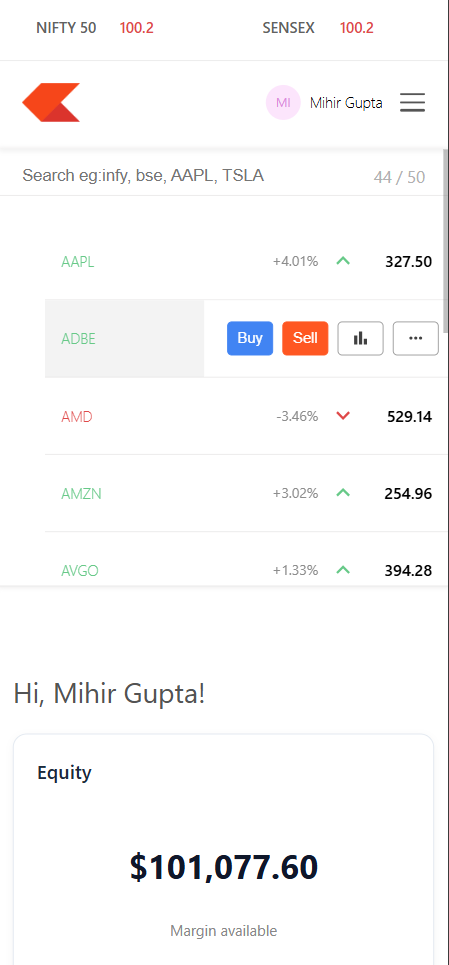
</p>

---

# 🎬 Project Walkthrough Video

Watch the complete video walkthrough covering system architecture, session security syncs, transaction rollbacks, and portfolio analytics.

<p align="center">
<a href="./assets/ZerodhaVideo.mp4">
  
</a>
</p>

---

# ✨ Features

## 👤 Trading Features

- Browse asset lists with real-time green/red visual ticker badges.
- Execute trades using MARKET or LIMIT execution routes.
- Lock available margin cash (for buy orders) or stock shares (for sell orders) instantly upon order placement.
- Automatically cancel outstanding limit orders after 24 hours, returning locked funds or shares.
- Log ledger updates containing margin parameters: Available Margin, Blocked Margin, and Realized P&L.
- Log bank transactions for simulated withdrawals and deposits.
- View asset allocations dynamically graphed on doughnut charts.

---

## ⚙️ Brokerage Core Features

- **Order Matching Engine**: A background worker polling market prices and updating status.
- **EOD Settlement**: A daily script migrating positions to permanent holdings (calculating weighted average purchase costs).
- **Market Hours Protection**: Prevents transactions outside simulated US market hours (7:00 PM IST to 1:30 AM IST).

---

## 🔐 Security Features

- JWT Session authentication.
- Single Sign-Out (SSO) cross-origin synchronization.
- Back-button browser (bfcache) session protection.
- Express-rate-limiter and Helmet security headers configuration.
- Joi input payload schema validation.

---

# 🛠️ Technology Stack

| Category | Technologies |
|----------|--------------|
| **Frontend** | React 18, React Router v6, Axios, Chart.js, CSS3 (Vanilla) |
| **Backend** | Node.js, Express.js |
| **Database** | MongoDB Atlas, Mongoose |
| **Asynchronous Scheduling** | Node-Cron |
| **Payment Sandbox** | Razorpay Test Checkout API |
| **Security & Logging** | JWT, Bcrypt, Helmet, Express-Rate-Limit, Winston Logger |

---

# 🏗️ System Architecture

Kite Console follows a secure, micro-routed architecture:

```text
                  Client Browser (Port 3000 / 3001)
                                │
                      Express.js API (Port 3002)
        ┌───────────────────────┼───────────────────────┐
        │                       │                       │
  MongoDB Atlas          Razorpay Checkout        Finnhub Prices
```

### Architecture Highlights

- Isolated marketing origin (port 3000) and dashboard origin (port 3001).
- Unified Express.js API (port 3002).
- Node-Cron schedulers running price synchronization and EOD settlement scripts.

---

# 📁 Project Structure

```text
Stock-Trading-Platform/
│
├── Backend/                    # Express.js Server
│   ├── config/                 # Winston logging & DB configs
│   ├── controllers/            # Controller handlers
│   ├── cron/                   # Schedulers (Matcher, price sync, EOD)
│   ├── middleware/             # JWT auth & security filters
│   ├── model/                  # Mongoose models (Holdings, Orders)
│   ├── routes/                 # Express API routes
│   └── services/               # Core logic (Settlement, Trading)
│
├── dashboard/                  # Console Panel (React Web App)
│   ├── public/                 # Pre-mount loaders
│   └── src/                    # Views & Components
│
└── frontend/                   # Marketing Portal (React Web App)
    └── src/                    # Landing page layouts
```

---

# 🔌 REST API Directory

### Authentication

| Method | Endpoint | Description |
|---------|----------|-------------|
| POST | `/signup` | Create user profile and pre-fund account |
| POST | `/login` | Verify credentials and return JWT token |

---

### Portfolio & Trades

| Method | Endpoint | Description |
|---------|----------|-------------|
| GET | `/allHoldings` | Fetch settled holdings |
| GET | `/allPositions` | Fetch active positions |
| POST | `/newOrder` | Submit trade (Market/Limit) |
| GET | `/allOrders` | Fetch order history |

---

### Wallet Management

| Method | Endpoint | Description |
|---------|----------|-------------|
| POST | `/portfolio/funds` | Log withdrawal requests |
| POST | `/portfolio/funds/order` | Initialize Razorpay payment intent |
| POST | `/portfolio/funds/verify` | Verify payment check signature |
| GET | `/portfolio/transactions` | Fetch audit logs |

---

# ⚙️ Installation & Setup

Clone the project

```bash
git clone https://github.com/mihirgupta665/Stock-Trading-Platform-.git
cd Stock-Trading-Platform-
```

Navigate to Backend and start

```bash
cd Backend
npm install
# Create a .env file (see variables template below)
npm start
```

Navigate to Dashboard and start

```bash
cd ../dashboard
npm install
npm start
```

Navigate to Frontend and start

```bash
cd ../frontend
npm install
npm start
```

---

# 🔐 Environment Variables

Create a `.env` file in the project roots:

### Backend (`Backend/.env`)
```env
MONGO_URL=your_mongodb_connection_string
JWT_SECRET=your_jwt_secret_key
PORT=3002
TIMEZONE=Asia/Kolkata
SETTLEMENT_TIME=01:31
PRICE_REFRESH_INTERVAL=*/2 * * * *
FINNHUB_API_KEY=your_finnhub_key
RAZORPAY_KEY_ID=your_razorpay_key
RAZORPAY_KEY_SECRET=your_razorpay_secret
```

### Dashboard (`dashboard/.env`)
```env
PORT=3001
REACT_APP_API_URL=http://localhost:3002
REACT_APP_FRONTEND_URL=http://localhost:3000
```

---

# 🚀 Deployment Overview

| Origin / Layer | Service Provider |
|----------------|------------------|
| **Marketing Portal** | Vercel (Static Web Hosting) |
| **Console Dashboard** | Vercel (Static Web Hosting) |
| **API Engine** | Render / Railway (Dynamic Server Host) |
| **Database Cache** | MongoDB Atlas (Cloud Cluster) |

---

# 📈 Engineering Highlights (Deep Dives)

### 1. Preventing Double Spending via Capital Locks
When placing limit buy orders, funds are immediately locked to prevent over-purchasing. When selling, target asset quantities are deducted immediately.
- **Deduction & Hold**: Trade submissions verify available liquid cash or shares. If verified, funds or shares are deducted and stored in `"BLOCKED"` status on the pending order, maintaining ledger consistency.
- **Rollback Safeties**: If an order is canceled or expires, a transactional rollback runs, releasing the blocked assets back to the user's active wallet balance.

### 2. Hybrid Nightly EOD Settlement Logic
Positions represent active intraday exposure, while holdings are settled multi-day assets.
- **Atomic Transactions**: A daily cron job executes at `1:31 AM IST`. It aggregates active user positions and migrates them into holdings (calculating weighted average purchase costs) in a single transaction.
- **Eventual Consistency Fallback Handler**: Free-tier cloud instances sleep after inactivity, missing cron schedules. To ensure consistency, a fallback checks cutoff times on dashboard loads. If positions are older than 24 hours, the settlement executes dynamically before resolving statistics.

### 3. SSO and Browser bfcache Session Shielding
To prevent unauthorized navigation when accessing the console:
- **SSO Sync**: The dashboard and marketing portal coordinate tokens. If the token is cleared in one tab, the other origin detects the change and logs the user out.
- **bfcache Protection**: Browsers restore DOM states without hitting the network on backward clicks. An HTML5 `pageshow` listener detects cache retrievals, checks active tokens, and redirects immediately on session deletion.

---

# 🔮 Future Improvements
- **WebSockets Engine**: Deliver real-time stock tickers to the watchlist via socket streams.
- **Candlestick Charts**: Integrate interactive financial charts to display historical trade ranges.
- **Trailing Stop Loss**: Add advanced order triggers (`SL` and `SL-M` models).

---

# 🤝 Contributing

Contributions are welcome! Please fork the repository, make changes in a feature branch, and open a Pull Request.

---

# 📄 License

This project is made only for exploring and learning purpose.

---

# 👨💻 Author

## Mihir Gupta

B.Tech Computer Science Engineering (AI & ML)

Passionate developer focused on building scalable, transactional applications and low-latency APIs.

- **GitHub**: [github.com/mihirgupta665](https://github.com/mihirgupta665)
- **LinkedIn**: [https://www.linkedin.com/in/mihir-gupta-980173299/](https://www.linkedin.com/in/mihir-gupta-980173299/)

---

<p align="center">
  <strong>Thank you for visiting Kite Console! Happy Trading ❤️</strong>
</p>
